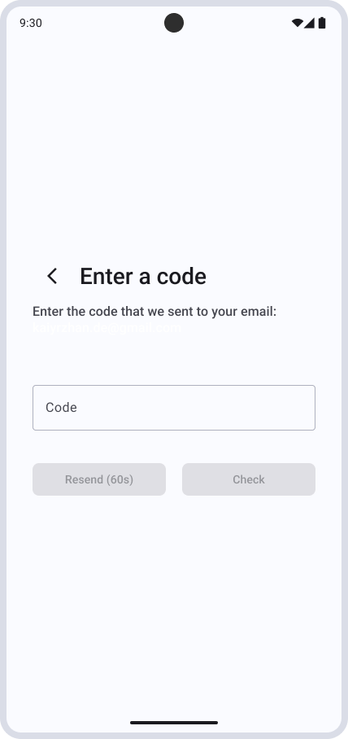
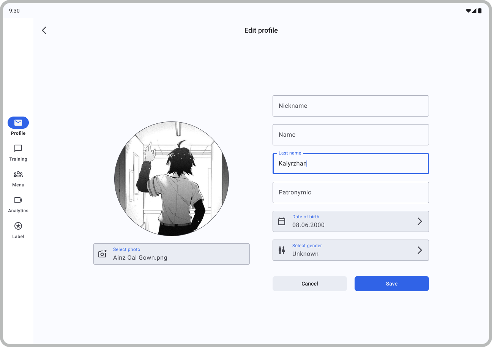
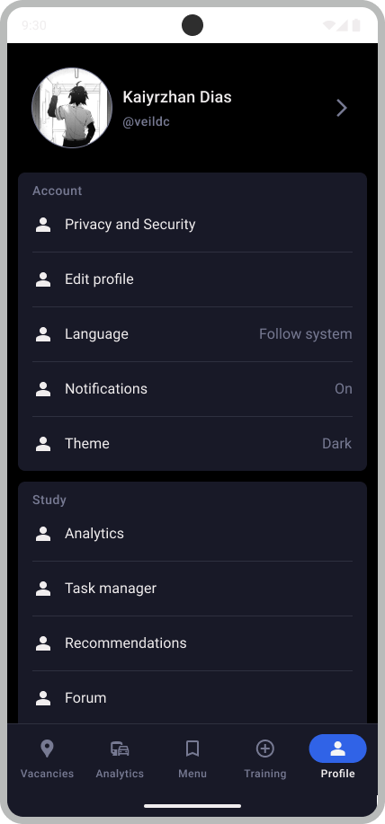

# Empath

**Empath** is a cross-platform application for job search, resume building, article publishing, and interview preparation — built entirely with Kotlin Multiplatform (KMP). The project is in active development and serves as both a real-world product prototype and an architectural playground.

---

## Project Goals

- Explore Kotlin Multiplatform (KMP) in a full-scale application targeting **Android**, **iOS**, and **Desktop**.
- Compare modern architectural solutions (e.g., Decompose, Gradle Convention Plugins) with traditional Android stack used in commercial projects.
- Build a reusable, scalable project template based on **Clean Architecture** and **feature-based modularization**.
- Improve architectural thinking and developer visibility beyond platform boundaries.

---

## Tech Stack

### Core:
- **Kotlin Multiplatform** – Shared codebase across Android, iOS, Desktop.
- **Clean Architecture** – Clear separation of concerns across layers.
- **Modularization** – Feature-based modular structure for scalability and maintainability.

### Infrastructure:
- **Gradle Convention Plugins** – Standardized build logic and dependency management.
- **Koin** – Dependency injection framework.
- **Ktor + Ktorfit** – Typed REST client built on top of Ktor for network communication.
- **DataStore** – Multiplatform key-value storage.
- **Coil** – Image loading.

### Architecture & Navigation:
- **Decompose** – Navigation + MVI for all KMP targets.

### Design:
- **Figma UI Kit** – Design system created in Figma  
  [Figma link](https://www.figma.com/design/2wDsNvMCxN8Yaku307S3t2/empath-ui-kit?node-id=86-5475&t=c2hltXsLG7NsMO65-1)

### Code Confirmation

| Type    | Theme | Screenshot                                                             |
|---------|-------|------------------------------------------------------------------------|
| Mobile  | White |  |
| Mobile  | Dark  |   |
| Desktop | White |  |
| Desktop | Dark  |   |

### Email Verification

| Type    | Theme | Screenshot                                                              |
|---------|-------|-------------------------------------------------------------------------|
| Mobile  | White |  |
| Mobile  | Dark  |   |
| Desktop | White |  |
| Desktop | Dark  |   |

### Loading

| Type    | Theme | Screenshot                                                   |
|---------|-------|--------------------------------------------------------------|
| Mobile  | White |  |
| Mobile  | Dark  |   |
| Desktop | White |  |
| Desktop | Dark  |   |

### Login

| Type    | Theme | Screenshot                                                 |
|---------|-------|------------------------------------------------------------|
| Mobile  | White |  |
| Mobile  | Dark  |   |
| Desktop | White |  |
| Desktop | Dark  |   |

### Password Recovery

| Type    | Theme | Screenshot                                                             |
|---------|-------|------------------------------------------------------------------------|
| Mobile  | White |  |
| Mobile  | Dark  |   |
| Desktop | White |  |
| Desktop | Dark  |   |

### Post Create

| Type    | Theme | Screenshot                                                       |
|---------|-------|------------------------------------------------------------------|
| Mobile  | White |  |
| Mobile  | Dark  |   |
| Desktop | White |  |
| Desktop | Dark  |   |

### Post Detail

| Type    | Theme | Screenshot                                                       |
|---------|-------|------------------------------------------------------------------|
| Mobile  | White |  |
| Mobile  | Dark  |   |
| Desktop | White |  |
| Desktop | Dark  |   |

### Profile Edit

| Type    | Theme | Screenshot                                                        |
|---------|-------|-------------------------------------------------------------------|
| Mobile  | White |  |
| Mobile  | Dark  |   |
| Desktop | White |  |
| Desktop | Dark  |   |

### Profile

| Type    | Theme | Screenshot                                                   |
|---------|-------|--------------------------------------------------------------|
| Mobile  | White |  |
| Mobile  | Dark  |   |
| Desktop | White |  |
| Desktop | Dark  |   |

### Registration

| Type    | Theme | Screenshot                                                        |
|---------|-------|-------------------------------------------------------------------|
| Mobile  | White |  |
| Mobile  | Dark  |   |
| Desktop | White |  |
| Desktop | Dark  |   |

### Vacancies

| Type    | Theme | Screenshot                                                     |
|---------|-------|----------------------------------------------------------------|
| Mobile  | White |  |
| Mobile  | Dark  |   |
| Desktop | White |  |
| Desktop | Dark  |   |

### Vacancy Filters

| Type   | Theme | Screenshot                                                           |
|--------|-------|----------------------------------------------------------------------|
| Mobile | White |  |
| Mobile | Dark  |   |

---

## Modules (Planned)

- `:empath-app`
- `:core:uikit`
- `:core:network`
- `:core:utils`
- `:features:auth`
- `:features:profile`
- `:features:posts`
- `:features:file-storage`
- `:features:vacancies`

---

## Status

🔧 **In development** – expect rapid iterations, experimental features, and architectural exploration.

---

## Author
**Dias Kaiyrzhan**  
Android Developer | Kotlin Multiplatform Enthusiast  

